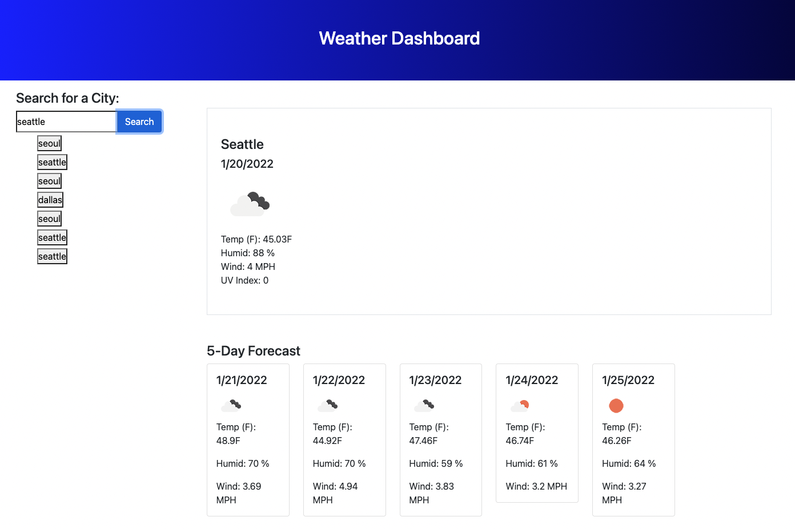

# Weather Dashboard

---------------

## Image Preview

------------------

## About Project 

Weather Dashboard current day / 5 days forcast with TEMP, Humidity, Wind, UV index

--------------------

## Technologies Used

- HTML, CSS, Bootstrap for styling Page 
- Javascript
- JQuery
- JSon for Local Storage
- Ajax
- API used for weather info (https://openweathermap.org/api)

--------------------

## Deployed Link

https://deashawnogle.github.io/Weather-Dashboard/

--------------------

